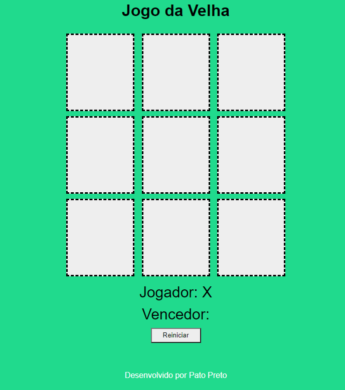
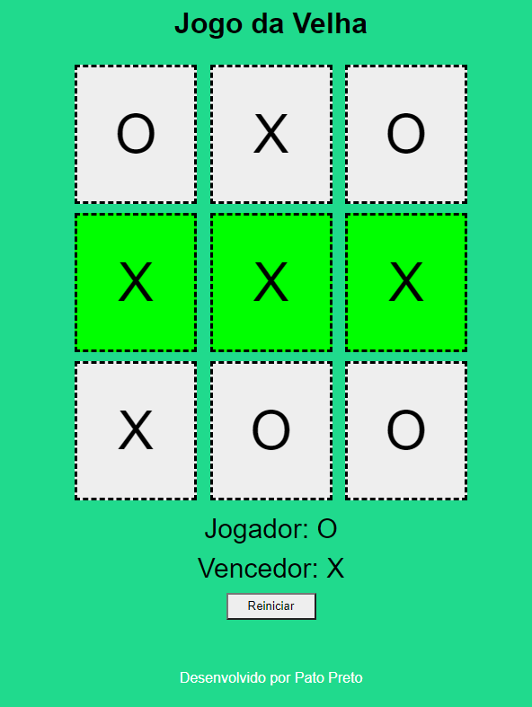

# jogo-da-velha
um jogo da velha no qual o jogador X vai primeiro e logo em seguida o jogador O clicando no quadrado respectivo.
O  resultado é mostrado ao usuário no final do jogo.

##Tecnologias utilizadas
 - **HTML:** Estrutura do site
 - **CSS:** Estilos do site
 - **JS:** Funções do site
 - ~~BootStrap~~: Não foi utilizado

### Melhorias possíveis
1. [x] Subir no github pages
2. [ ] Trocar o Alert pra mensagens mais amigaveis
3. [ ] Realizar teste para descobrir bugs 🕸

### disponivel em:
https://caotix.github.io/jogo-da-velha/
### referencias
https://github.com/WebersonRodrigues/jogo-da-velha

### imagens:

